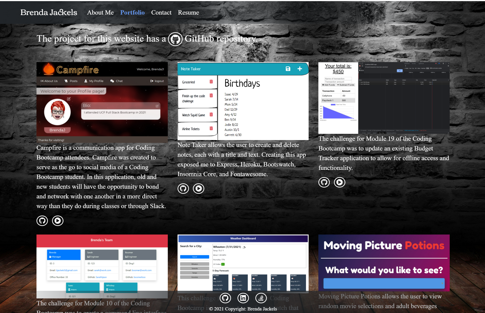

# Portfolio Website
This challenge for Module 20 of the Coding Bootcamp is to create a professional portfolio for myself using React.

* [Project URL](#projectURL)

* [User Story](#userStory)

* [Requirements](#requirements)

* [Technologies Used](#techUsed)

* [Credits](#credits)

* [What I Learned](#whatILearned)

* [Screenshot](#webImage)

* [Contact Me](#contactMe)

---

## Project URL
[Project URL](https://bjackels5.github.io/bjackels5-portfolio/)

---

## User Story

* AS AN employer looking for candidates with experience building single-page applications
* I WANT to view a potential employee's deployed React portfolio of work samples
* SO THAT I can assess whether they're a good candidate for an open position
--- 

## Requirements

* The portfolio must be a single-page application.
* When the portfolio is loaded, the user is presented with a page containing a header, a section for content, and a footer.
* The header contains:
    * the developer's name
    * navigation containing the following titles:
        * About Me
        * Portfolio
        * Contact
        * Resume
        * the title corresponding to the current section is highlighted
* Clicking on a navigation title presents the corresponding section below the navigation. This will not result in any page reloading.
* The *About Me* title and section are selected by default.
* The *About Me* section contains a recent photo and a short bio.
* The *Portfolio* section contains 6 of my applications, each with:
    * a link to the deployed application
    * a link to the corresponding GitHub repository
* The *Contact* section requires:
    * a contact form with fields:
        * name
        * email address
        * message
    * All fields are required, and a notification will appear to that affect when the cursor is moved out of an empty field
    * Text entered into the email address field is verified to be a valid email address, and the user is notified if it is not valid.
* The *Resume* section contains:
    * a link to a downloadable resume
    * a list of my proficiencies
* The footer contains:
    * A links to my GitHub profile
    * A link to my LinkedIn profile
    * A link to a third platform (I'll use Stack Overflow)
* Use a Create-React-App that contains:
    * A single Header component that appears on multiple pages
    * A single Navigation component within the header that will be used to conditionally render the different sections of your portfolio
    * A single Project component that will be used multiple times in the Portfolio section
    * A single Footer component that appears on multiple pages
* FOR NOW, The contact form should be similar to the one built in the module project. Because this application doesn’t include a back end or connect to an API, set up this functionality the same way it is in the module project and add in back-end functionality later. In the meantime, add my email address and phone number on the Contact page.
    
---

## Technologies Used

* React
* React Icons
* Bootstrap
* Node
* Google Drive: used to host the resume for download so that I can update it without having to modify this project.
* Google Fonts
* HTML
* CSS
* Create-React-App
* GitHub Pages
* Photoshop Elements

---

## Credits

* I found the background on 
[wallpaperflare.com](https://www.wallpaperflare.com/wall-of-rocks-grey-brick-wall-artistic-urban-wall-building-feature-wallpaper-poyok).
* Our TA, Mila, helped me with a bunch of styling on my Portfolio component, including getting the icon and text to both change on hover regardless of which one was actually hovered.
* I used https://favicon.io/favicon-converter/ to convert an image to a favicon.

--- 

## What I Learned

* I learned that the instructions in the Module to disable automatic browser opening for the CRA CLI are incorrect. The correct way to suppress the browser is to add "BROWSER=none" to the .env file. There are other methods that involved more steps.

* How to build a single-page application with React.
* How to create reusable components within a React application.
* How to manage state within React components.
* How to pass props to child components.
* Ho to use React Hooks to manage state in functional components.
* How to conditionally render components based on updates to state.
* How to Construct the elements of a webpage using JSX.
* How to debug errors in React.

---

## Project Screenshot

---

## Contact Me
You can reach me, Brenda Jackels, at bjackels5@gmail.com.

